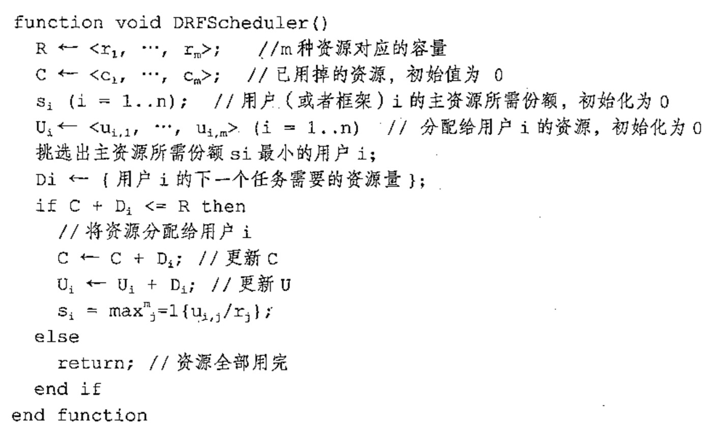

# big-data-knowledge
📖大数据相关知识集锦

* [hdfs](#hdfs)
* [yarn](#yarn)
* [hive](#hive)
* [mapreduce](#mapreduce)
* [spark](#spark)
* [hbase](#hbase)
* [zookeeper](#zk)
* [kafka](#kafka)
* [nsq](#nsq)
* [flink](#flink)
* [大数据面试题](#interview)
* [优秀文章](#article)

<h3 id="hdfs">hdfs</h3>

* HDFS简介

	HDFS是Hadoop Distributed File System的简写
	
	* HDFS具有高容错性和高吞吐性的特点
	* HDFS目前是 append only，暂时不支持随机 write 的操作
	* HDFS适合用于存储以及批量操作大规模的数据集(PB级别)
	* 不适合实时访问，具有高延迟性，例如新建了一张hive表，需要过一会才能看到
	* [Hadoop HDFS 教程（一）介绍](https://www.jianshu.com/p/8969eb90a59d)
	* [Hadoop HDFS（二）结构解析和名词解释](https://www.jianshu.com/p/86a70ac1f5f9)

* HDFS存在一个单点问题，即全Hadoop系统只有一个NameNode，如果NameNode挂了怎么办

    * 将hadoop元数据写入到本地文件系统的同时，再实时同步到一个远程挂载的网络文件系统
    * 运行一个secondaryNameNode
        * 元数据持久化到磁盘，在fsimage中存放元信息，在edits中存放对元信息的操作的文件
        * 定时到NameNode中去获取edit logs，并更新到fsimage
        * 一旦它有了新的fsimage文件，它将其拷贝回NameNode中
        * NameNode在下次重启时会使用这个新的fsimage文件，从而减少重启的时间

* HDFS中的块为什么这么大？

    HDFS的块比磁盘的块大，其目的是为了最小化寻址开销。如果块足够大，从磁盘传输数据的时间会明显大于定位这个块开始位置所需的时间。因而，传输一个由多个块组成的大文件的时间取决于磁盘传输速率

* HDFS的读流程和写流程

    读过程

    

    写过程

    

* HDFS通过CRC校验来保证数据的正确性
 
* proquet列式存储

    * [深入分析Parquet列式存储格式](http://www.infoq.com/cn/articles/in-depth-analysis-of-parquet-column-storage-format)
    * [Parquet 存储格式](https://www.cnblogs.com/hetonghai/p/9049327.html)
    * [Dremel made simple with Parquet](https://blog.twitter.com/engineering/en_us/a/2013/dremel-made-simple-with-parquet.html)
    * [Dremel: Interactive Analysis of Web-Scale Datasets](http://static.googleusercontent.com/media/research.google.com/zh-CN//pubs/archive/36632.pdf)

* HDFS 的联盟模式

	文件的元数据是放在namenode上的，只有一个Namespace（命名空间）。随着HDFS的数据越来越多，单个namenode的资源使用必然会达到上限，而且namenode的负载能力也会越来越高，限制HDFS的性能。

	Federation即为“联邦”，该特性允许一个HDFS集群中存在多个NameNode同时对外提供服务，这些NameNode分管一部分目录（水平切分），彼此之间相互隔离，但共享底层的DataNode存储资源

    联盟模式需要各个独立的集群自行进行数据共享，可以在整体 HDFS 服务上设置一个 Proxy 的代理层，存储 HDFS 路径与集群的映射，进而与对应的 NameNode 通信，同时在 Proxy 上，还可以做限流，资源限制，metric 等    

* [Hadoop NameNode 高可用 (High Availability) 实现解析](https://www.ibm.com/developerworks/cn/opensource/os-cn-hadoop-name-node/index.html)

<h3 id="yarn">yarn</h3>

* yarn简介

	yarn是hadoop内部的资源管理系统
	
	* 资源管理(10k的机器数)
		* CPU，Memory...
		* 资源利用 & 共享
	* 调度/监控分布式jobs
	* 统一的接口管理
		* MapReduce
		* Spark
		* Flink

* YARN是hadoop的集群资源管理系统，YARN被引入Hadoop 2，最初是为了改善MapReduce的实现，但它具有足够的通用性，也可以用于其他的分布式计算模式，例如Spark，那么MapReduce1和YARN的区别是啥呢？

    MapReduce1中，有两类守护进程控制者作业的执行过程：一个`jobtracker`及一个或多个`tasktracker`。jobtracker通过调度tasktracker上运行的任务来协调所有运行在系统上的作业。tasktracker在运行任务的同时将运行进度报告发送给jobtracker，jobtracker由此记录每项作业任务的整体进度情况。如果其中一个任务失败，jobtracker可以在另一个tasktracker节点上重新调度该任务。

    MapReduce1中，jobtracker同时负责作业调度(将任务与tasktracker匹配)和任务进度监控(跟踪任务、重启失败或迟缓的任务；记录任务流水，如维护计数器的计数)。相比之下，YARN中，这些职责是由不同的实体担负的：资源管理器和application master(每个 MapReduce 作业一个)。jobtracker也负责存储已完成作业的作业历史。在YARN中，与之等价的角色是时间轴服务器，它主要用于存储应用历史。

    YARN中与tasktracker等价的角色是节点管理器。
    
    | MapReduce1 | YARN |
    | ---------- | ---- |
    | Jobtracker | 资源管理器、application master、时间轴服务器|
    | Tasktracker| 节点管理器 |
    | Slot | 容器 |
    
* YARN中存在三种调度方法

    [YARN的三种调度方法](https://www.cnblogs.com/sodawoods-blogs/p/8877197.html)

	* FIFO
	* 容器调度器(Capacity Scheduler)
	* 公平调度器(Fair Scheduler)

* YARN 应用运行机制

	
	
	[YARN 基本原理](http://kentt.top/2018/09/16/Yarn-Architecture/#applicationmasteram)
	
* YARN 的内存调度和 CPU 调度

	[YARN 的内存调度和 CPU 调度](http://www.voidcn.com/article/p-cryxxsio-bbp.html)
	
* cgroup 和 namespace

	[容器Cgroup和Namespace特性简介](https://blog.csdn.net/xiangxianghehe/article/details/70569920)
	
	[Linux的Namespace与Cgroups介绍](https://blog.csdn.net/weixin_34138377/article/details/86024583)

* YARN 的事件处理模型

    

    处理请求会作为事件进入系统，由中央异步调度器(Async- Dispatcher)负责传递给相应事件调度器(Event Handler)。该事件调度器可能将该事件转发给 另外一个事件调度器，也可能交给一个带有有限状态机的事件处理器，其处理结果也以事 件的形式输出给中央异步调度器。而新的事件会再次被中央异步调度器转发给下一个事件 调度器，直至处理完成(达到终止条件)

    在 YARN 中，所有核心服务实际上都是一个中央异步调度器，包括 ResourceManager、 NodeManager、MRAppMaster(MapReduce 应 用 程 序 的 ApplicationMaster) 等， 它 们 维 护 了事先注册的事件与事件处理器，并根据接收的事件类型驱动服务的运行

* ResourceManager 的基本功能

    1. 与客户端交互，处理来自客户端的请求，包括提交应用程序、查询应用程序状态和控制应用程序等（比如杀死应用程序）等
    2. 启动和管理 ApplicationMaster，并在它运行失败时重新启动它
    3. 管理 NodeManager，接收来自 NodeManager 的资源汇报信息，并向 NodeManager 下达管理指令（比如杀死 Container 等）
    4. 资源管理和调度，接收来自 ApplicationMaster 的资源申请请求，并为之分配资源

* 脑裂：脑裂是指在主备切换时，由于切换不彻底或其他原因，导致客户端和 Slave 误以为出现了两个 Active Master，最终使得整个集群处于混乱状态。通常采用隔离（Fencing）机制解决脑裂问题，解决脑裂可以从下面三个方向考虑

    1. 共享存储隔离：确保只有一个 Master 往共享存储中写数据
    2. 客户端隔离：确保只有一个 Master 可以响应客户端的请求
    3. Slave 隔离：确保只有一个 Master 可以向 Slave 下发命令

    Hadoop 公共库对外提供了两种隔离实现，分别是 sshfence 和 shellfence。其中 sshfence 是指通过 SSH 登录目标 Master 节点上，使用命令 fuser 将进程杀死；shellfence 是指执行一个用户事先定义的 Shell 命令（脚本）完成隔离。

* YARN HA

    * ApplicationMaster 容错：不同的应用程序拥有不同的 ApplicationMaster，而 RM 负责监控 ApplicationMaster 的运行状态，一旦发现它运行失败或者超时，会为其重新分配资源并启动它。至于启动之后 ApplicationMaster 内部的状态如何恢复需要自己保证，比如 MRAppMaster（MapReduce ApplicationMaster）在作业运行过程中将状态信息动态记录到 HDFS 上，一旦出现故障重启之后，它能够从 HDFS 中读取并恢复之前的状态，以减少重新计算带来的开销

    * NodeManager 容错：如果 NodeManager 在一定时间内未向 ResourceManager 汇报心跳消息，则 ResourceManager 认为它已经死掉了，会将它上面所有正在运行的 Container 状态设置为失败，并告诉对应的 ApplicationMaster（如果 AM Container 运行失败，则需要重新分配资源启动 ApplicationMaster），以决定如何处理这些 Container 中运行的任务

    * Container 容错：如果 ApplicationMaster 在一定的时间内未启动分配的 Container，则 ResourceManager 会将该 Container 状态置为失败并回收它；如果一个 Container 在运行过程中，因为外界原因导致运行失败，则 ResourceManager 会转告给对应的 ApplicationMaster，由它决定如何处理

    * ResourceManager 容错：YARN 也是使用主备热切换来实现 ResourceManager 的容错的，YARN 将共享存储系统抽象成 RMStateStore（一个 Java 接口），以保存（出故障后）恢复 RM 所必须的信息：包括 Application 状态信息 ApplicationState、Application 对应的每个 ApplicationAttempt 信息 ApplicationAttemptState 以及安全令牌相关信息 RMDTSecretManagerState，RM 提供了四种 RMStateStore 实现 —— NullRMStateStore（不存储任何状态信息）、MemoryRMStateStore（将状态信息存储到内存中）、FileSystemRMStateStore（将状态信息存储到 HDFS 中）、ZKRMStateStore（将状态信息存储到 Zookeeper 上）。需要注意的是，ResourceManager HA只完成了第一个阶段的设计，即备ResourceManager启动后，会杀死之前正在运行的Application，然后从共享存储系统中读取这些Application的元数据信息，并重新提交这些Application。启动 ApplicationMaster 后，剩下的容错功能就交给 ApplicationMaster 实现了，比如 MapReduce 的 ApplicationMaster 会不断地将完成的任务信息写到 HDFS 上，这样，当它重启时，可以重新读取这些日志，进而只需重新运行那些未完成的任务。ResourceManager HA 第二个阶段的任务是，备 ResourceManager 接管主 ResourceManager 后，无需杀死那些正在运行的 Application，让他们像任何事情没有发生一样运行下去

* YARN 资源调度器基本架构

	

* YARN 的资源调度模型

	YARN 采用了双层资源调度模型：在第一层中，RM 中的资源管理器将资源分配给各个 ApplicationMaster；在第二层中，ApplicationMaster 再进一步将资源分配给它内部的各个任务。YARN 的资源分配过程是异步的，也就是说，资源调度器将资源分配给一个应用程序后，不会立即 push 给对应的 ApplicationMaster，而是暂时放到一个缓冲区中，等待 ApplicationMaster 通过周期性的心跳来获取，也就是说，YARN 使用的是 pull-based 而不是 push-based
	
	* 资源调度器资源分配流程
	
		1. NM 通过周期性的心跳汇报节点信息
		2. RM 为 NM 返回一个心跳应答，包括需要释放的 Container 列表
		3. RM 触发一个 NODE_UPDATE 事件
		4. 资源调度器收到 NODE_UPDATE 事件后，会按照一定的策略将该节点上的资源分配给各应用程序
		5. AM 向 RM 发送周期性的心跳，领取分配的 Container
		6. RM 返回 Container 列表
		7. AM 在 Container 上启动 Task

		
	
	* 资源分配算法 —— DRF

		DRF（Dominant Resource Fairness），算法伪代码如下：
		
		
		
		简单来说，DRF 首先计算每个任务的主资源，主资源是任务中每个资源占用整体资源比例最大的资源，然后开始循环分配，当资源不够满足的时候 break，DRF 每次循环都会将资源分配给已分配的主资源 / 整体资源比例最小的任务
		
		[DRF](http://blog.sina.com.cn/s/blog_768df4d70102vjn2.html)

* YARN 的资源抢占模型

    1. SchedulingEditPolicy 探测到需要抢占的资源，将需要抢占的资源通过事件 DROP\_RESERVATION 和 PREEMPT\_CONTAINER 发送给 ResourceManager
    2. RM 调用相应的 EventHanler 标注待抢占的 Container
    3. RM 收到来自 ApplicationMaster 的心跳信息，并通过心跳应答将待释放的资源总量和待抢占 Container 列表返回给它
    4. SchedulingEditPolicy 探测到一段时间内，ApplicationMaster 没有自行杀死约定的 Container，则将这些 Container 封装到 KILL\_CONTAINER 的 killContainer 函数
    5. RM 会将杀死的 Container 列表通过心跳包应答返回给 NM
    6. NM 杀死，通过心跳包返回给 RM，RM 再通过心跳包发送给 ApplicationMaster
    
    

* YARN 默认的资源抢占算法

    

    核心思想是 YARN 会为每个队列设置最小资源，然后将所有的最小资源加起来，得到 minResourceSum，再将每个队列的最小资源 / minResourceSum，得到一个比例，这个比例 * 当前待分配的资源 = 本次循环，YARN 给予这个队列的资源，如果队列不使用，也就是 wQdone = 0，资源就会被分配给其他队列，其实就是根据 current + pending 来计算的，当 pending 的任务多了，就会试图从其他队列中抢占资源
        
* 容量调度器和公平调度器的比较

    

    公平调度：按照内存资源使用量比率调度，即按照 used_memory/minShare 大小调度
    
* YARN 的资源隔离

	YARN 对内存资源和 CPU 资源采用了不同的资源隔离方案。对于内存资源，它是一种限制性资源，它的量的大小直接决定的应用程序的死活
	
	YARN 采用线程监控的方案控制内存使用，每个 NM 会启动一个额外监控线程监控每个 Container 内存资源使用量，一旦发现它超过约定的资源量，则将其杀死，采用这种机制的另外一个原因是 Java 中创建子进程采用了 "fork() + exec()" 的方案，子进程启动瞬间，它使用的内存量与父进程一致，这样从外面来看，一个进程使用的内存量可能瞬间翻倍，然后又降低下来，采用线程监控的方案可以防止这种情况下导致的 swap 操作
	
	CPU 资源，是一种弹性资源，它的量的大小不会直接影响到应用程序的死活，因此采用了 Cgroups
	
	YARN 使用了 Cgroups 中的 CPU 和 Memory 子系统，CPU 子系统用于控制 Cgroups 中所有进程可以使用的 CPU 时间片。用户可根据需要修改 Cgroups 目录下的 cpu.shares 文件配置进程的 CPU 使用份额，而 CPU 子系统能够根据写入的整数值控制该进程获得的时间片，CPU 子系统是通过 Linux CFS 调度器实现的，在 "完全理想的多任务处理器" 下，CFS 能够使得每个进程都能同时获得 CPU 的执行时间。当系统中有两个进程的时候，CPU 的计算时间被分为两份，每个进程获得 50%。然而在实际的硬件上，当一个进程占用 CPU 时，其他进程就必须等待。所以 CFS 将惩罚当前进程，使其他进程能够在下次调度的时候尽可能的取代当前进程，最终实现所有进程的公平调度

<h3 id="hive">hive</h3>

* [hive基本结构与数据存储](https://www.cnblogs.com/pejsidney/p/8953402.html)

* [数据仓库基本概念](https://www.cnblogs.com/muchen/category/794750.html)

* 数据仓库(DW/Data Warehouse)分层原则(每家公司都有自己的规范)

	* dim：维度层，一般用于存储属性信息，多用于联表查询
	* dwd/ods(data warehouse detail)：事实明细层，存储事实表的明细粒度数据，比较底层的数据，源数据清洗得来，例如埋点后捞出来的数据
	* dwa(data warehouse aggregation)：事实聚合层，存储事实表聚合粒度数据，按需求联合查询得到的聚合表
	* app(application)：应用层，存储直接供给应用的数据

	

* hive的join操作，只支持等值匹配，不支持like模糊匹配，如果非要使用like，需要使用笛卡尔积，这个效率太低，不如放到内存中匹配，下面是笛卡尔积的写法

    ```sql
    SELECT table1.brand, SUM(table2.sold) 
    FROM table1, table2
    WHERE table2.product LIKE concat('%', table1.brand, '%') 
    GROUP BY table1.brand;
    ```

* hive表分为内部表和外部表，内部表drop的时候会将hdfs上的数据**一起删除**，外部表drop的时候**不会删除**hdfs上的数据

* 创建hive表语句栗子

	```sql
	create external table table_name (
		uid bigint comment '用户id',
		name string
	) comment '用户表'
	PARTITIONED BY (`date` string)
	ROW FORMAT DELIMITED
		FIELDS TERMINATED BY `\t` // 指定每行中字段分隔符为\t
		LINES TERMINATED BY `\n` // 指定行分隔符
		COLLECTION ITEMS TERMINATED BY `,` // 指定集合中元素之间的分隔符
		MAP KEYS TERMINATED BY `:` // 指定数据中Map类型的Key与Value之间的分隔符
	LOCATION
		'hdfs://XXX'
	```
	
	external指代这张表是否为外部表

* 向hive表中加载数据

	* 建表时直接指定

		如果你的数据已经在hdfs上存在，已经为结构化的数据，并且数据所在的hdfs路径不需要维护，那么直接在create的时候指定location字段为hdfs路径即可
	
	* 从本地文件系统或者hdfs的一个目录中加载，使用 LOAD DATA命令加载数据

		```sql
		load data local inpath XXX overwrite into table partition(day = '20180808') # load 本地文件
		
		load data inpath XXX overwrite into table partition(day = '20180808') # load hdfs文件
		```
		
	* 从一个select查询中load 数据

		```sql
		insert overwrite table table_name partition(day = '20180808')
		
		select
			*
		from
			table
		where
			date = '20180808'
		```

* hive中join的原理和机制

	笼统的说，hive中的join可以分为common join(reduce阶段完成join)和map join(map阶段完成join)
	
	* common join
	
		* map阶段
		
			读取源表的数据，map输出时候以join on条件中的列为key，如果Join有多个关联键，则以这些关联键的组合作为key。map输出的value为join之后所关心的(select或者where中需要用到的)列，同时在value中还会包含表的Tag信息，用于标明此value对应哪个表；
			
		* shuffle阶段
	
			根据key的值进行hash,并将key/value按照hash值推送至不同的reduce中，这样确保两个表中相同的key位于同一个reduce中
			
		* reduce阶段
			
			根据key数值完成join操作，期间通过tag来识别不同表中的数据
			
		* 例子
	
			```sql
			SELECT 
				a.id,
				a.dept,
				b.age 
			FROM
				a join b 
			ON
				a.id = b.id;
			```
			
			
	
	* map join

		MapJoin 通常用于一个很小的表和一个大表进行 join 的场景，具体小表有多小，由参数 hive.mapjoin.smalltable.filesize 来决定，该参数表示小表的总大小，默认值为25000000字节，即25M
		
		Hive 0.7之前，需要使用hint提示 `/*+ mapjoin(table) */` 才会执行 MapJoin，否则执行 Common Join，但在0.7版本之后，默认自动会转换 Map Join，由参数 hive.auto.convert.join 来控制，默认为true。仍然以上面的 HQL 来说吧，假设a表为一张大表，b为小表，并且 hive.auto.convert.join=true，那么Hive在执行时候会自动转化 MapJoin
		
		
		
		* 如图中的流程，首先是Task A，它是一个Local Task（在客户端本地执行的Task），负责扫描小表b的数据，将其转换成一个HashTable的数据结构，并写入本地的文件中，之后将该文件加载到DistributeCache中
		* 接下来是Task B，该任务是一个没有Reduce的MR，启动MapTasks扫描大表a,在Map阶段，根据a的每一条记录去和DistributeCache中b表对应的HashTable关联，并直接输出结果
		* 由于MapJoin没有Reduce，所以由Map直接输出结果文件，有多少个Map Task，就有多少个结果文件

* hive sql的优化

    * [Hive SQL的优化](http://lxw1234.com/archives/2015/06/317.htm)
    * [hive优化之——控制hive任务中的map数和reduce数](http://lxw1234.com/archives/2015/04/15.htm)
    * [yarn mapreduce或者hive参数最佳实践](https://blog.csdn.net/T1DMzks/article/details/80204420)

* hive函数总结

    [hive函数总结](https://www.cnblogs.com/yejibigdata/p/6380744.html)
    
* hive的text存储格式和parquet存储格式

	text是行式存储，多用于手动load数据进入hive表，例如`pandas.Dateframe.tocsv()`
	
	parquet是列式存储，在一列有很多相同数值(例如NULL和常数)这样的时候，稀疏存储能省很多空间，同时列式存储在select的时候不用遍历每行，直接遍历列就行
	
* hive中的压缩设置

	* hive.exec.compress.intermediate：默认该值为false，设置为true为激活中间数据压缩功能。HiveQL语句最终会被编译成Hadoop的Mapreduce job，开启Hive的中间数据压缩功能，就是在MapReduce的shuffle阶段对mapper产生的中间结果数据压缩。在这个阶段，优先选择一个低CPU开销的算法。
	* mapred.map.output.compression.codec：该参数是具体的压缩算法的配置参数，SnappyCodec比较适合在这种场景中编解码器，该算法会带来很好的压缩性能和较低的CPU开销。
	* hive.exec.compress.output：用户可以对最终生成的Hive表的数据通常也需要压缩。该参数控制这一功能的激活与禁用，设置为true来声明将结果文件进行压缩。
	* mapred.output.compression.codec：将hive.exec.compress.output参数设置成true后，然后选择一个合适的编解码器，如选择SnappyCodec。

		```
		set hive.exec.compress.intermediate=true;
		set mapred.map.output.compression.codec=org.apache.hadoop.io.compress.SnappyCodec;
		set hive.exec.compress.output=true;
		set mapred.output.compression.codec=org.apache.hadoop.io.compress.SnappyCodec;
		```
	
* Hive中文件格式可以在`create table`的时候指明，默认是采用textfile的格式，也可以指定为orc，parquet等

	```
	create table if not exists...
	
	store as orc/parquet
	```

* hive可以通过load local data将本地文件load到hdfs上，但是parquet的文件不能这样，需要先用pandas的df.to\_parquet()，才可以推上去(该方法新增于0.21.0版本)

	```
	import pandas as pd
	df = pd.DataFrame(data={'col1': [1, 2]})
	df.to_parquet('df.parquet.snappy', compression='snappy')
	pd.read_parquet('df.parquet.snappy')
	...
		col1
	0	1
	1	2
	```

* hive命令后面的选项

    * hive -f：使用-f选项可以运行指定文件中的命令，`hive -f script.q`指代我们运行脚本文件`script.q`
    * hive -S：无论是在交互式还是非交互式模式下，Hive都会把操作运行时的信息打印输出到标准错误输出，使用-S可以强制不显示这些信息
    * hive -e：使用-e选项可以在行内嵌入命令，例如`hive -e 'select * from table'`

* hive中查看函数使用方法的工具函数

    `describe function length`来查看length的用法

* hive从0.14.0版开始允许使用`INSERT INTO TABLE...VALUES`语句来插入一小撮以文字形式指明的记录，它并不是直接插入到data file，而是将数据放入暂存目录，由hive底层的同步进程周期性拷贝过去

* hive支持多表插入

    ```
    FROM source
    INSERT OVERWRITE TABLE target1
    select col1
    INSERT OVERWRITE TABLE target2
    select col2;
    ```

* hive中使用order by的时候会对数据进行全排列，同时只会使用一个reducer worker，我们可以用sort by和distribute by来进行代替，因为这个时候我们可以手动设置多个reducer worker，方法如下：

    ```
    set mapred.reduce.tasks=2;
    ```

* 和 Hadoop Streaming 类似，TRANSFORM、MAP和REDUCE子句可以在Hive中调用外部脚本或程序，如下所示:

    ```
    ADD FILE /Users/map.py;
    
    select
        transform(year, temperature, quality)
    using
        'python map.py'
    as
        year, temperature
    from
        record
    ```

    ```
    from (
        from record2
        map year, temperature, quality
        using 'python is_good_quality.py'
        as year, temperature)map_output
    reduce year, temperature
    using 'python max_temperature_reduce.py'
    as year, temperature;
    ```

    上面的`map`和`reduce`关键字都可以用`transform`来替换

* [Hive中实现Group By后，取Top K条记录](https://www.coder4.com/archives/4059)，这篇博客用的是UDF，python的话也可以使用transform调用map.py来实现相似的功能

* [Hive 数据倾斜解决方案（调优）](https://blog.csdn.net/s646575997/article/details/51510661)

* hive join 优化 -- 小表join大表

    * 小、大表join
        
        在小表和大表进行join的时候，将**小表放在前面**，效率会高，hive会将小表缓存

    * mapjoin

        使用mapjoin将小表放入内存，在map端和大表逐一匹配，从而省去reduce

        ```
        select
            /*+mapjoin(b)*/ a.a1,
            a.a2,
            b.b2
        from
            tablea a
        join
            tableb b
        on
            a.a1 = b.b1
        ```
    
        在0.7版本后，也可以用配置来自动化

        ```
        set hive.auto.convert.join=true;
        ```

* hive 获取分组 topk 

    hive 不能像 mysql 一样用局部变量和嵌套子查询来做，但是 hive 提供了 `rank`，`row_number`，`dense_rank` 三个函数
    
    [Hive分组取Top N数据](https://blog.csdn.net/WYpersist/article/details/80318305)

    ```
    select
        name,
        subject,
        score,
        rank() over (partition by name order by score desc) as rank
    from
        table
    group by
        name,
        subject,
        score
    ```

* hive 行列转换

    [Hive--行转列（Lateral View explode()）和列转行（collect_set() 去重）](http://www.voidcn.com/article/p-kvqbqneb-bbk.html)
    
    explode 这个 UDTF 会生成一个虚表，需要和 lateral view 一同使用，`lateral view explode (expression) table as col`

    * 行转列

        ```
        select
            col1,
            col2,
            name
        from
            game.game_test
        lateral view explode(split(col3, ',')) t as name
        ```
    
    * 列转行

        ```
        select
            col1,
            col2,
            concat_ws(',', collect_set(col3)) as col3
        from
            game.game_test
        group by
            col1,
            col2
        ``` 

* hive 随机取样

    ```
    select
        *
    from
        table
    distribute by rand()
    sort by rand()
    ```

* [Hive 常用函数](https://www.cnblogs.com/MOBIN/p/5618747.html#4)

* Hive 的 like 和 rlike 的区别

	like不是正则，而是通配符。这个通配符可以看一下SQL的标准，例如%代表任意多个字符。rlike是正则，正则的写法与java一样。'\'需要使用'\\',例如'\w'需要使用'\\w'
	
* Hive 的 count(1)、count(*) 和 count(column) 有什么区别

	count(1)和count(*)一样，统计行数，包括含有null value的行数

	count(column)仅统计该列非空的行数

* Hive 函数中 slice, substr 和 substring 有什么区别

	首先，他们都接收两个参数，slice 和 substring 接收的是起始位置和结束位置(不包括结束位置)，而 substr 接收的则是起始位置和所要返回的字符串长度
	
* [Hive 窗口函数](http://www.aboutyun.com/thread-12831-1-1.html)

* [Hive 优化](http://www.k6k4.com/simple_question/qshow/aaqeigfak1540308027814)

* Hive 底层 null 是用 '\N' 存储的

* [Hive array, map, struct 使用](https://blog.csdn.net/u010670689/article/details/72885944)

* 当 Hive map 阶段执行很慢的时候，可以考虑增加 map 的 vcore

* 其实很多时候 hive 的优化可以通过拆分中间表来做，提升会很显著的，复杂的 hive sql 都会变成很多个 stage 的 mr 任务，这时候处理中间数据带来的消耗也是很大的，我自己亲身经历的例子，拆分中间表后，执行时间从 17h -> 2h，cpu 和内存使用数量也是降低了将近 100%

* hive 并行执行 job

	```
	set hive.exec.parallel=true;   //打开任务并行执行
	set hive.exec.parallel.thread.number=16; //同一个sql允许最大并行度，默认为8
	```
	
	```
	from (  
	select phone,to_phone, substr(to_phone,-1) as key  
	from youni_contact4_lxw   
	where youni_id='1'   
	and length(to_phone) = 11   
	and  substr(to_phone,1,2) IN ('13','14','15','18')   
	group by phone,to_phone, substr(to_phone,-1)   
	) t  
	insert overwrite table youni_contact41_lxw partition(pt='0')  
	select phone,to_phone where key='0'  
	insert overwrite table youni_contact41_lxw partition(pt='1')  
	select phone,to_phone where key='1'  
	insert overwrite table youni_contact41_lxw partition(pt='2')  
	select phone,to_phone where key='2'  
	insert overwrite table youni_contact41_lxw partition(pt='3')  
	select phone,to_phone where key='3'  
	insert overwrite table youni_contact41_lxw partition(pt='4')  
	select phone,to_phone where key='4'  
	insert overwrite table youni_contact41_lxw partition(pt='5')  
	select phone,to_phone where key='5'  
	insert overwrite table youni_contact41_lxw partition(pt='6')  
	select phone,to_phone where key='6'  
	insert overwrite table youni_contact41_lxw partition(pt='7')  
	select phone,to_phone where key='7'  
	insert overwrite table youni_contact41_lxw partition(pt='8')  
	select phone,to_phone where key='8'  
	insert overwrite table youni_contact41_lxw partition(pt='9')  
	select phone,to_phone where key='9'; 
	```
	
	该SQL产生11个job，第一个job为生成临时表的job，后续job都依赖它，这时不会有并行启动，

	第一个job完成后，后续的job都会并行启动

* [hive的集合类型Array、Map和Struct及相应的创建、插入、查询操作](https://blog.csdn.net/qq_41973536/article/details/81627918)

* 有一批气象观测站，现需要获取这些站点的观测数据，并存储到 Hive 中。但是气象局只提供了 api 查询，每次只能查询单个观测点。那么如果能够方便快速地获取到所有的观测点的数据？

    * 一般的做法：可以并发调用 api，将所有气象观测站的数据存储到本地，最后在 load data 到 Hive 上
    * 比较好的做法：是在计算引擎的 UDF 中调用查询 api，执行UDF 的查询结果存储到对应的表中。一方面，不需要同步任务的导出导入；另一方面，计算引擎的分布式框架天生提供了分布式、容错、并发等特性

<h3 id="mapreduce">mapreduce</h3>

* MapReduce简介
    
    MapReduce是一个编程模型，也是一个处理和生成超大数据集的算法模型的相关实现。用户首先创建一个Map函数处理一个基于k/v pair的数据集合，输出中间的基于k/v pair的数据集合；然后再创建一个Reduce函数用来合并所有的具有相同中间key值的中间value值，MapReduce架构的程序能够在大量的普通配置的计算机上实现并行化处理，可以用于处理TB级别的数据

    

	* 用户程序首先调用的MapReduce库将输入文件分成M个数据片段，每个数据片段的大小从16MB到512MB(可以通过可选的参数来控制每个数据片段的大小)。然后用户程序在机群中创建大量的程序副本。
	* 这些程序副本中的有一个特殊的程序 - master。副本中其它的程序都是worker程序，由master分配任务。有M个Map任务和R个Reduce任务将被分配，master将一个Map任务或Reduce任务分配给一个空闲的worker。
	* 被分配了map任务的worker程序读取相关的输入数据片段，从输入的数据片段中解析出k/v pair，然后把k/v pair传递给用户自定义的Map函数，由Map函数生成并输出的中间k/v pair，并缓存在内存中。
	* 缓存中的k/v pair 通过分区函数分成R个区域，之后周期性的写入到本地磁盘上。缓存的k/v pair在本地磁盘上的存储位置将被回传给master，由master负责把这些存储位置再传送给Reduce worker。
	* 当Reduce worker程序接收到master程序发来的数据存储位置信息后，使用RPC从Map worker所在主机的磁盘上读取这些缓存数据。当Reduce worker读取了所有的中间数据后，通过key进行排序后使得具有相同key值的数据聚合在一起。由于许多不同的key值会映射到相同的Reduce任务上，因此必须排序。如果中间数据太大无法在内存中完成排序，那么就要在外部进行排序。
	* Reduce worker程序遍历排序后的中间数据，对于每一个唯一的中间key值，Reduce worker程序将这个key值和它相关的中间 value 值的集合传递给用户自定义的 Reduce 函数。Reduce 函数的输出被追加到所属分区的输出文件
	* 当所有的 Map 和 Reduce 任务都完成之后，master 唤醒用户程序。在这个时候，在用户程序里的对 MapReduce 调用才返回。

* MapReduce的shuffle过程

    * [MapReduce shuffle过程详解](https://blog.csdn.net/u014374284/article/details/49205885) 这篇博客讲的还阔以，但是有两个地方有问题，一是key通过hash取模获得partition是在进入kvbuffer之后，二是reduce worker从map worker copy数据不是通过http，而是通过rpc

    * [Hadoop深入学习：MapReduce的Shuffle过程详解](http://flyingdutchman.iteye.com/blog/1879642)

    * 总的来说，shuffle阶段可以分为map端的partition阶段，sort阶段，以及reduce端的copy阶段和merge阶段
    
    * reduce端的merge不是一次性完成的，比如，如果有50个map输出，而合并因子是10（10为默认值，由mapreduce.task.io.sort.factor属性设置），合并将进行5趟，每趟将10个文件合并成一个文件，因此最后有5个中间文件，然后，将这5个文件作为reduce的输入，从而省去了一次磁盘的往返过程

        

* mr的inputfile可以写多个，可以在map.py中通过数据格式来区分不同的文件，也可以通过环境变量来得到hdfs上文件的绝对路径

    [在mr streaming中获取文件名](https://blog.csdn.net/bitcarmanlee/article/details/51735053)

* Hadoop Streaming

    
    
    python编写mapreduce就是使用了Hadoop Streaming的特点
    
    * Streaming的优点：
    	* 开发效率高
    		* 只需按照一定的格式从标准输入读取数据、向标准输出写数据就行
    		* 容易单机调试: cat input | mapper | sort | reducer > output
    	* 程序运行效率高
			* 对于CPU密集的计算，有些语言如C/C++编写的程序可能比用Java效率高一些
		* 便于平台进行资源控制
			* Streaming框架中通过limit等方式可以灵活地限制应用程序使用的内存资源
	* Streaming的局限
		* Streaming默认只能处理文本数据
		* 两次数据拷贝和解析（分割），带来一定的开销
	
	* Streaming的开发要点：
		* input：指定输入文件的HDFS路径，支持使用*通配符和指定多个文件或目录，可多次使用
		* output：指定输出文件的HDFS路径，路径必须不存在，且具备创建该目录的权限，只能使用一次
		* mapper：用户自己写的mapper程序
		* reduer：用户自己写的reduce程序
		* file：打包文件到提交的作业中
			* map和reduce的执行文件，如run.sh
			* map和reduce要用输入的文件，如配置文件
			* 还有-cacheFile, -cacheArchive分别用于向计算节点分发HDFS文件和HDFS压缩文件
		* jobconf：提交作业的一些配置属性，常见配置：
			* mapred.map.tasks：map task数目
			* mapred.reduce.tasks：reduce task数目
			* stream.map.output.field.separator：指定 map task 输出记录中 key 所使用的分隔符，默认是使用 \t
			* stream.num.map.output.key.fields：指定map task输出记录中key所占的域数目
			* map.output.key.field.separator：指定 partition 阶段对 map 输出使用哪种分隔符
			* num.key.fields.for.partition：指定对key分出来的前几部分做partition，而非整个key，需要配合 -partitioner org.apache.hadoop.mapred.lib.KeyFieldBasedPartitioner 一同使用，修改默认的 hashPartition
			* mapred.compress.map.output：map的输出是否压缩
			* mapred.map.output.compression.codec：map的输出压缩方式
			* mapred.output.compress：reduce的输出是否压缩
			* mapred.output.compression.codec：reduce的输出压缩方式
    		
* mapreduce中的combine阶段，众所周知，mapreduce中有map和reduce两个阶段，其实还有一个用户可以选择的combine阶段，对map出来的数据进行预聚合，减少传递给reduce worker的数据量，加快处理速度，例如，求出某个key的最大值，就可以在map worker中取对应的key的最大值，不用将所有的数据都丢给reduce worker，combiner函数在map 排序后的输出上运行

* MapReduce框架在记录到达reducer之前按key对记录排序，但key所对应的值并没有排序。甚至在不同的执行轮次中，这些值的排序也不固定，因为它们来自不同的map任务且这些map任务在不同轮次中完成时间各不相同。一般来说，大多数MapReduce程序会避免让reduce函数依赖于值的排序。但是，有时也需要通过特定的方法对key进行排序和分组等以实现对值的排序，例如统计每年的最高气温就很适合

    ```
    hadoop jar path.jar \
        -D stream.num.map.output.key.fields=2 \
        -D mapreduce.partition.keypartitioner.options=-k1,1 \
        -D mapreduce.job.output.key.comparator.class=org.apache.hadoop.mapred.lib.KeyFieldBasedComparator \
        -D mapreduce.partition.keycomparator.options="-k1n -k2nr" \
        -files map.py,reduce.py
        -input input/all
        -output output
        -mapper "python map.py"
        -partitioner org.apache.hadoop.mapred.lib.KeyFieldBasedPartitioner \
        -reducer "python reduce.py"
    ```

    [mapreduce 多个列做key](http://www.zhangdongshengtech.com/article-detials/240)

    设置`stream.num.map.output.key.fields`为2，等于说，value是空，但是在分区的时候，只用key来分区，确保了一致性，设置keycomparator，按照第一列升序，第二列降序来排序，实现既定功能，reduce的时候只需要取出每一年的第一条记录就行

* MapReduce中常见的join方法

    * reduce side join

        reduce side join是一种最简单的join方法，在map阶段同时读取两个文件file1和file2，为了区分两种来源的key/value数据对，然后对每条数据打一个tag，比如：tag=0表示来自文件File1，tag=2表示来自文件File2。即：map阶段的主要任务是对不同文件中的数据打标签。在reduce阶段，reduce函数获取key相同的来自File1和File2文件的value list， 然后对于同一个key，对File1和File2中的数据进行join（笛卡尔乘积）。即：reduce阶段进行实际的连接操作

    * map side join

        之所以存在reduce side join，是因为在map阶段不能获取所有需要的join字段，即：同一个key对应的字段可能位于不同map中。Reduce side join是非常低效的，因为shuffle阶段要进行大量的数据传输。Map side join是针对以下场景进行的优化：两个待连接表中，有一个表非常大，而另一个表非常小，以至于小表可以直接存放到内存中。这样，我们可以将小表复制多份，让每个map task内存中存在一份（比如存放到hash table中），然后只扫描大表：对于大表中的每一条记录key/value，在hash table中查找是否有相同的key的记录，如果有，则连接后输出即可

    * SemiJoin

        SemiJoin，也叫半连接，是从分布式数据库中借鉴过来的方法。它的产生动机是：对于reduce side join，跨机器的数据传输量非常大，这成了join操作的一个瓶颈，如果能够在map端过滤掉不会参加join操作的数据，则可以大大节省网络IO。
实现方法很简单：选取一个小表，假设是File1，将其参与join的key抽取出来，保存到文件File3中，File3文件一般很小，可以放到内存中。在map阶段，使用DistributedCache将File3复制到各个TaskTracker上，然后将File2中不在File3中的key对应的记录过滤掉，剩下的reduce阶段的工作与reduce side join相同

    * reduce side join + BloomFilter

        在某些情况下，SemiJoin抽取出来的小表的key集合在内存中仍然存放不下，这时候可以使用BloomFiler以节省空间。
BloomFilter最常见的作用是：判断某个元素是否在一个集合里面。它最重要的两个方法是：add() 和contains()。最大的特点是不会存在false negative，即：如果contains()返回false，则该元素一定不在集合中，但会存在一定的true negative，即：如果contains()返回true，则该元素可能在集合中。因而可将小表中的key保存到BloomFilter中，在map阶段过滤大表，可能有一些不在小表中的记录没有过滤掉（但是在小表中的记录一定不会过滤掉），这没关系，只不过增加了少量的网络IO而已

* 推测执行

	推测执行(Speculative Execution)是指在集群环境下运行 MapReduce，可能是程序 Bug，负载不均或者其他的一些问题，导致在一个 JOB 下的多个 TASK 速度不一致，比如有的任务已经完成，但是有些任务可能只跑了10%，根据木桶原理，这些任务将成为整个 JOB的短板，如果集群启动了推测执行，这时为了最大限度的提高短板，Hadoop 会为该 task 启动备份任务，让 speculative task 与原始 task 同时处理一份数据，哪个先运行完，则将谁的结果作为最终结果，并且在运行完成后 Kill 掉另外一个任务。
		
	推测执行(Speculative Execution)是通过利用更多的资源来换取时间的一种优化策略，但是在资源很紧张的情况下，推测执行也不一定能带来时间上的优化，假设在测试环境中，DataNode 总的内存空间是40G，每个 Task 可申请的内存设置为1G，现在有一个任务的输入数据为5G，HDFS 分片为128M，这样 Map Task 的个数就40个，基本占满了所有的DataNode节点，如果还因为每些 Map Task 运行过慢，启动了 Speculative Task，这样就可能会影响到 Reduce Task 的执行了，影响了 Reduce 的执行，自然而然就使整个 JOB的执行时间延长。所以是否启用推测执行，如果能根据资源情况来决定，如果在资源本身就不够的情况下，还要跑推测执行的任务，这样会导致后续启动的任务无法获取到资源，以导致无法执行。

<h3 id="spark">spark</h3>

* spark-cluster的工作模式

    

* RDD的三种生成方式

    * 从内存中的对象集合生成
    * 从本地文件或hdfs中读取出
    * 从RDD转换而来

* RDD支持两种类型的操作，转化操作(transformation)和行动操作(action)，转化操作会由一个RDD生成一个新的RDD，行动操作会对RDD计算出一个结果，转化操作和行动操作的区别在于Spark计算RDD的方式不同，虽然你可以在任何时候定义新的RDD，但Spark只会惰性计算这些RDD，它们只有第一次在一个行动操作中用到时，才会真正计算

* 如果在多个行动中重用同一个操作，可以使用`RDD.persist()`或`RDD.cache()`让Spark把这个RDD缓存下来，提高效率

* 创建RDD最简单的方式就是把程序中一个已有的集合传给SparkContext的`parallelize()`

    `lines = sc.parallelize(['a', 'b', 'c'])`

* 向Spark传递函数的时候需要小心，python会在你不经意的时候把函数所在的对象也序列化传递出去，当你传递的对象是某个对象的成员，或者包含了对某个对象中一个字段的引用时(例如self.field)，Spark就会把整个对象发送到工作节点上

	```python
	class SearchFunctions(object):
		def __init__(self, query):
			self.query = query
		def isMatch(self, s):
			return self.query in s
		def getMatchesFunctionReference(self, rdd):
			# 问题: 在"self.isMatch"中引用了整个self
			return rdd.filter(self.isMatch)
		def getMatchesMemberReference(self, rdd):
			# 问题: 在"self.query"中引用了整个self
			return rdd.filter(lambda x: self.query in x)
	```
	
	替代方法是存储为局部变量，然后传递局部变量
	
	```python
	class WordFunctions(object):
		...
		def getMatchesMemberReference(self, rdd):
			query = self.query
			return rdd.filter(lambda x: query in x)
	```

* spark中collect函数可以打印出rdd中所有的数值，但是需要保证内存装的下，collectAsMap方法和collect类似，用于pair RDD，最终返回Map类型的结果

    ```python
    rdd = sc.parallelize([(1, 2), (1, 3), (3, 3)])
    rdd.collectAsMap()

    # {1: 3, 3: 3}
    ```

    RDD中同一个key中存有多个value，后面的会覆盖前面的，最终得到的结果就是key唯一

* spark的分区操作

    spark能够对数据集在节点间的分区进行控制，在分布式程序中，通信的代价是很大的，因此控制数据分布以获得最少的网络传输可以极大地提升整体性能。分区并不是对所有的应用都有好处的--比如，如果给定RDD只需要被扫描一次，我们完全没必要预先进行分区处理。类似`join()`，`cogroup()`，`reduceByKey()`等操作，分区很有好处

    python中分区例子

    ```python
    rdd.partitionBy(100)
    ```

* Spark的共享变量类型：广播和累加器

    * 广播，可以高效的让程序向所有工作节点发送一个较大的只读值，以供一个或多个Spark操作使用

        ```python
        broadcast_var = sc.broadcast(T)

        在工作节点可以通过broadcast_var.value来获取广播变量
        ```
    
    * 累加器，可以在不同的工作节点写累加器，然后在驱动器程序中调用

        ```python
        # 在Python中累加空行

        file = sc.textFile(inputfile)
        blankLines = sc.accumulator(0)
        
        def extractCallSigns(line):
            global blankLines

            if line == '':
                blankLines += 1

            return line.split(' ')

        callSigns = file.flatMap(extractCallSigns)
        callSigns.saveAsTextFile(outputDir)
        print 'Blank lines: %d' % blankLines.value
        ```

* 基于分区进行操作

    * mapPartitions(f)，f的参数是各分区的迭代器，return一个迭代器

        ```python
        rdd = sc.parallelize([1, 2, 3, 4], 4)
        def f(units): yield sum(units)
        rdd.mapPartitions(f).collect()
        # [1, 2, 3, 4]
        ```

    * mapPartitionsWithIndex(f), f的参数是partition的idx和迭代器，return一个迭代器

        ```python
        rdd = sc.parallelize([1, 2, 3, 4], 4)
        def f(idx, units): yield idx
        rdd.mapPartitionsWithIndex(f).sum()
        # 6
        ```

    * foreachPartition(f)，f的参数是一个迭代器

        ```python
        rdd = sc.parallelize([1, 2, 3, 4], 4)
        def f(units):
            for u in units:
                print u
        rdd.foreachPartition(f)
        ```

* spark应用提交到集群上的方法: spark-submit --py-files \*.py --master yarn-client python\_file.py

* 在yarn-client模式或者独立模式下的spark应用，可以在驱动器ip下的4040端口查看spark任务的状态，DAG等信息，很有用

* spark性能优化

    * 利用分区提高并行度
    * 当Spark需要通过网络传输数据，或是将数据溢写到磁盘上，Spark需要把数据序列化为二进制文件，可以采用Kryo的第三方序列化库，能够获得更短的序列化时间和更高的压缩比
    * 使用persist或者cache方法缓存分区，避免重复计算
    * 设置executor节点的cores和memory

* spark sql可以直接通过hivesql访问hive表格的数据，需要把hive\_site.xml放到spark的conf文件夹中，也可以直接访问hdfs的parquet，orc文件，然后注册临时表

    ```python
    from pyspark.sql import HiveContext

    hiveCtx = HiveContext(sc)
    rows = hiveCtx.sql(hive_sql)

    data = hiveCtx.read.parquet(path of parquet in hdfs)
    data.registerTempTable('table') # 作为临时表
    hiveCtx.sql("select * from table")
    ```

* spark sql允许用户自定义函数(UDF)，可以将自定义函数类似hive中的count函数一样用于sql中

    ```python
    hiveCtx.registerFunction('strLen', lambda x: len(x), IntegerType())
    df = hiveCtx.sql("select strLen('name') from table")
    ```

    如果要返回一个list，可以使用types里的StructField和StructType来自定义

    ```python
    schema = StructType([StructType('name', StringType(), True), StructType('age', IntegerType(), True)])
    udf_func = hiveCtx.registerFunction('udf_func', lambda x: (x, 1), schema)
    ```

* spark的rdd和spark.sql的df的横行merge和纵向merge方法

    * rdd
        * 横向 map / mapPartitions
        * 纵向 union
    * df
        * 横向 crossJoin(select alias) / join
        * 纵向 union

* 和Spark基于RDD的概念很相似，Spark Streaming使用离散化流作为抽象表示，叫做DStream，Spark Streaming 会把每个interval收到的数据放入DStream

* Dstream的转化操作可以分为有状态和无状态两种，有状态的可以创建window，处理多个interval的数据

* [Spark Streaming 简介](http://bigdataer.net/?p=244)
    
* [spark 将dataframe数据写入hive表](https://blog.csdn.net/zgc625238677/article/details/53928320)，基本思路是先将df注册为本地table，再从本地table insert到hive表中

* [spark 基本算子](https://blog.csdn.net/cymy001/article/details/78483723)

* [spark 常见面试题](https://zhuanlan.zhihu.com/p/47499258)

* [美团 spark 调优分享](https://tech.meituan.com/2016/04/29/spark-tuning-basic.html)

* [Spark Shuffle原理及相关调优](http://sharkdtu.com/posts/spark-shuffle.html)

* Spark 如何防止内存溢出？

    * driver 端的内存溢出，提高 SparkConf 里 spark.driver.memory 的数值
    * map过程产生大量对象导致内存溢出，rePartition 成更多的 partition
    * shuffle后内存溢出，这是 Spark reducer 去 shuffle read 的时候，内容太多导致 OOM，可以增加 shuffle parition 的数量，可以通过在 SparkConf 里设置 spark.sql.shuffle.partitions

* Spark 数据倾斜

    如果 Spark 任务长时间卡在最后一个 task，那么很可能是发生了数据倾斜

    * 首先，我们分析一下，是那些 key 导致了数据倾斜
    * 如果是 null，空值或者一些测试用的没有意义的数据，直接过滤即可
    * 如果是业务相关的数据，可以将异常的key过滤出来单独处理，最后与正常数据的处理结果进行union操作，也可以将原始的 key 转化为 key + 随机值(例如Random.nextInt)，进行操作后，去掉随机值，再进行一次操作

* Spark 优化

	* 当缩小 partition 的时候，使用 coalesce 替换 repartition
	* 在 Python 中，传递给 Spark 参数的时候，如果是 class 的对象，先将对象定义为本地对象，再上传，不然会因为这个函数将整个对象上传
	* Spark shuffle 里的 block size 不能大于2g，设置 spark.sql.shuffle.partitions 来增加 block num
	* 尽可能使用 reduceByKey 代替 groupByKey

		
		
	
	* Spark 应用程序中，在对 RDD 进行 shuffle 和 cache 时，数据都是需要被序列化才可以存储的，此时除了 IO 外，数据序列化也可能是应用程序的瓶颈。这里推荐使用 kryo 序列库，在数据序列化时能保证较高的序列化效率

		```
		sc_conf = SparkConf()
	   sc_conf.set("spark.serializer", "org.apache.spark.serializer.KryoSerializer")
		```
	
	* Spark 的 shuffle 过程非常消耗资源，应该尽量避免

		Broadcast与map进行join代码示例

		```
		// 传统的join操作会导致shuffle操作。
		// 因为两个RDD中，相同的key都需要通过网络拉取到一个节点上，由一个task进行join操作。
		val rdd3 = rdd1.join(rdd2)
		
		// Broadcast+map的join操作，不会导致shuffle操作。
		// 使用Broadcast将一个数据量较小的RDD作为广播变量。
		val rdd2Data = rdd2.collect()
		val rdd2DataBroadcast = sc.broadcast(rdd2Data)
		
		// 在rdd1.map算子中，可以从rdd2DataBroadcast中，获取rdd2的所有数据。
		// 然后进行遍历，如果发现rdd2中某条数据的key与rdd1的当前数据的key是相同的，那么就判定可以进行join。
		// 此时就可以根据自己需要的方式，将rdd1当前数据与rdd2中可以连接的数据，拼接在一起（String或Tuple）。
		val rdd3 = rdd1.map(rdd2DataBroadcast...)
		
		// 注意，以上操作，建议仅仅在rdd2的数据量比较少（比如几百M，或者一两G）的情况下使用。
		// 因为每个Executor的内存中，都会驻留一份rdd2的全量数据。
		```
	
	* 使用mapPartitions替代普通map
	* 使用foreachPartitions替代foreach
	* 使用filter之后进行coalesce操作
	* 广播大变量
		
		```
		// 以下代码在算子函数中，使用了外部的变量。
		// 此时没有做任何特殊操作，每个task都会有一份list1的副本。
		val list1 = ...
		rdd1.map(list1...)
		
		// 以下代码将list1封装成了Broadcast类型的广播变量。
		// 在算子函数中，使用广播变量时，首先会判断当前task所在Executor内存中，是否有变量副本。
		// 如果有则直接使用；如果没有则从Driver或者其他Executor节点上远程拉取一份放到本地Executor内存中。
		// 每个Executor内存中，就只会驻留一份广播变量副本。
		val list1 = ...
		val list1Broadcast = sc.broadcast(list1)
		rdd1.map(list1Broadcast...)
		```
	
	* 设置 spark.default.parallelism

		* 参数说明：该参数用于设置每个 stage 的默认 task 数量。这个参数极为重要，如果不设置可能会直接影响你的 Spark 作业性能。
		* 参数调优建议：Spark 作业的默认 task 数量为 500\~1000 个较为合适。很多同学常犯的一个错误就是不去设置这个参数，那么此时就会导致 Spark 自己根据底层 HDFS 的 block 数量来设置 task 的数量，默认是一个 HDFS block 对应一个 task。通常来说，Spark 默认设置的数量是偏少的（比如就几十个task），如果task数量偏少的话，就会导致你前面设置好的Executor的参数都前功尽弃。试想一下，无论你的Executor进程有多少个，内存和CPU有多大，但是task只有1个或者10个，那么90%的Executor进程可能根本就没有task执行，也就是白白浪费了资源！因此Spark官网建议的设置原则是，设置该参数为 num-executors * executor-cores 的2\~3倍较为合适，比如 Executor 的总 CPU core 数量为300个，那么设置1000个 task 是可以的，此时可以充分地利用 Spark 集群的资源
		
* [Spark 性能优化](https://www.iteblog.com/archives/1659.html)

* 基于RDD实现的Spark相比于传统的Hadoop MapReduce有什么优势呢

    * RDD提供了丰富的操作算子，不再是只有map和reduce两个操作了，对于描述应用程序来说更加方便
    * 通过RDDs之间的转换构建DAG，中间结果不用落地
    * RDD支持缓存，可以在内存中快速完成计算

* 一个Spark应用程序包括Job、Stage以及Task三个概念

	1. Job 是以 Action 方法为界，遇到一个 Action 方法则触发一个 Job
	2. Stage 是 Job 的子集，以 RDD 宽依赖（即 Shuffle）为界，遇到 Shuffle 做一次划分
	3. Task 是 Stage 的子集，以并行度（分区数）来衡量，分区数是多少，则有多少个 Task

* Spark 的 Driver 在初始化 SparkContext 的过程中，会分别初始化 DAGScheduler、TaskScheduler、SchedulerBackend 以及 HeartbeatReceiver，并启动 SchedulerBackend 以及 HeartbeatReceiver。SchedulerBackend 通过 ApplicationMaster 申请资源，并不断从 TaskScheduler 中拿到合适的 Task 分发到 Executor 执行。HeartbeatReceiver 负责接收 Executor 的心跳信息，监控 Executor 的存活状况，并通知到 TaskScheduler

* DAGScheduler 会将 Stage 打包到 TaskSet 交给 TaskScheduler，TaskScheduler 会将其封装为 TaskSetManager 加入调度队列中，TaskSetManager 负责监控管理同一个 Stage 中的 Tasks，TaskScheduler 就是以 TaskSetManager 为单元来调度任务的

* [Spark Scheduler内部原理剖析](http://sharkdtu.com/posts/spark-scheduler.html)

* TaskScheduler 的调度方法有 FIFO 和 Fair 两种，可以在 SparkConf 中设置 `spark.scheduler.mode = FAIR` 来使用公平模式

* [Spark 容错](https://blog.csdn.net/WYpersist/article/details/79774463)

* [Spark 调度模式（FIFO/FAIR）](https://www.jianshu.com/p/61c967450062)

* [spark消费kafka的两种方式](https://blog.csdn.net/woloqun/article/details/80635304)

* [Spark Streaming对Exactly Once的实现原理](https://blog.csdn.net/cymvp/article/details/52605987)

<h3 id="hbase">hbase</h3>

* hbase是一个在HDFS上开发的面向列的分布式数据库，如果需要实时地随机访问超大规模数据集，就可以使用HBase这一Hadoop应用

* hbase也是一个master-slave的存储模型，它用一个master节点协调管理一个或多个regionserver从属机。hbase主控机(master)负责启动一个全新的安装，把区域分配给注册的regionserver，恢复regionserver的故障，master的负载很轻。regionsever负责零个或多个的区域管理以及响应客户端的读写请求。regionserver还负责区域的划分并通知HBase master有了新的子域

    

* [HBase深入浅出](https://www.ibm.com/developerworks/cn/analytics/library/ba-cn-bigdata-hbase/index.html)

* [LSM 树在 HBase 中的应用](https://blog.csdn.net/liuxiao723846/article/details/52971511)

* [HBase 工作原理](https://blog.csdn.net/qq_26803795/article/details/80796359)

* [HBase 架构以及应用介绍](https://blog.csdn.net/devcy/article/details/79790113)

* [一文了解数据库索引：哈希、B-Tree 与 LSM](https://juejin.im/post/5ca07cd851882567b2034938?utm_source=gold_browser_extension#heading-9)

<h3 id="zk">zookeeper</h3>

* [ZooKeeper简介](https://juejin.im/post/5b970f1c5188255c865e00e7?utm_source=gold_browser_extension)

* ZooKeeper维护着一个树形层次结构，树中的节点被称为znode。znode可以用于存储数据，并且有一个与之相关联的ACL(AccessControlLists)。ZooKeeper被设计用来实现协调服务(这类服务通常使用小数据文件)，而不是用于大容量数据存储，因此一个znode能存储的数据被限制在1MB以内

* ZooKeeper可以用来实现分布式锁，分布式锁能够在一组进程之间提供互斥机制，使得在任何时刻只有一个进程可以持有锁。分布式锁可以用于在大型分布式系统中实现领导者选举，在任何时间点，持有锁的那个进程就是系统的领导者。为了使用ZooKeeper来实现分布式锁服务，我们使用顺序znode来为那些竞争锁的进程强制排序。思路很简单：首先指定一个作为锁的znode，通常用它来描述被锁定的实体，称为\/leader，然后希望获得锁的客户端创建一些短暂顺序znode，作为锁znode的子节点。在任何时间点，顺序号最小的客户端将持有锁。例如，有两个客户端差不多同时创建znode，分别为/leader/lock-1和/leader/lock-2，那么创建/leader/lock-1的客户端将会持有锁，因为znode顺序号最小，只有前一个znode释放了锁，后一个才能获得锁

* 为什么最好使用奇数台服务器构成ZooKeeper集群

    我们知道在ZooKeeper中Leader选举算法采用了Zab(ZooKeeper Atomic Broadcast 原子广播)协议。Zab核心思想是当多数Server写成功，则任务数据写成功

    * 如果有3个Server，则最多允许1个Server挂掉
    * 如果有4个Server，则同样最多允许1个Server挂掉
    
    既然3个或者4个Server，同样最多允许1个Server挂掉，那么它们的可靠性是一样的，所以选择奇数个ZooKeeper Server即可

* Zab 协议核心：所有的事务请求必须一个全局唯一的服务器（Leader）来协调处理，集群其余的服务器称为 follower 服务器。Leader 服务器负责将一个客户端请求转化为事务提议（Proposal），并将该 proposal 分发给集群所有的 follower 服务器。之后 Leader 服务器需要等待所有的 follower 服务器的反馈，一旦超过了半数的 follower 服务器进行了正确反馈后，那么 Leader 服务器就会再次向所有的 follower 服务器分发 commit 消息，要求其将前一个 proposal 进行提交。因为半数 follower 服务器 ack 之后，写操作就 commit 了，因此 zookeeper 不能保持随时一致性，只能保证最终一致性

	

* ZooKeeper 领导人选举

	领导人选举分为第一次投票和变更投票两个阶段
	
	第一次投票。无论哪种导致进行Leader选举，集群的所有机器都处于试图选举出一个Leader的状态，即LOOKING状态，LOOKING机器会向所有其他机器发送消息，该消息称为投票。投票中包含了SID（服务器的唯一标识）和ZXID（事务ID），(SID, ZXID)形式来标识一次投票信息。假定Zookeeper由5台机器组成，SID分别为1、2、3、4、5，ZXID分别为9、9、9、8、8，并且此时SID为2的机器是Leader机器，某一时刻，1、2所在机器出现故障，因此集群开始进行Leader选举。在第一次投票时，每台机器都会将自己作为投票对象，于是SID为3、4、5的机器投票情况分别为(3, 9)，(4, 8)， (5, 8)。
	
	变更投票。每台机器发出投票后，也会收到其他机器的投票，每台机器会根据一定规则来处理收到的其他机器的投票，并以此来决定是否需要变更自己的投票，这个规则也是整个Leader选举算法的核心所在，其中术语描述如下
	
	vote\_sid：接收到的投票中所推举Leader服务器的SID。
	
	vote\_zxid：接收到的投票中所推举Leader服务器的ZXID。
	
	self\_sid：当前服务器自己的SID。
	
	self\_zxid：当前服务器自己的ZXID。

    事务 id 是一个64位的整数，前32位代表 leader 选择的轮次，每重新选举一次 leader，自增1，同时将后32位清零，后32位代表本轮内的事务顺序，一条事务到来的时候，自增1
	
	每次对收到的投票的处理，都是对(vote\_sid, vote\_zxid)和(self\_sid, self\_zxid)对比的过程。

	规则一：如果vote\_zxid大于self\_zxid，就认可当前收到的投票，并再次将该投票发送出去。

	规则二：如果vote\_zxid小于self\_zxid，那么坚持自己的投票，不做任何变更。

	规则三：如果vote\_zxid等于self\_zxid，那么就对比两者的SID，如果vote\_sid大于self\_sid，那么就认可当前收到的投票，并再次将该投票发送出去。

	规则四：如果vote\_zxid等于self\_zxid，并且vote\_sid小于self\_sid，那么坚持自己的投票，不做任何变更。

	结合上面规则，给出下面的集群变更过程
	
	
	
	由上面规则可知，通常那台服务器上的数据越新（ZXID会越大），其成为Leader的可能性越大，也就越能够保证数据的恢复。如果ZXID相同，则SID越大机会越大
	
* Zab 协议恢复模式的保证

	* 我们绝不能遗忘已经被deliver的消息，若一条消息在一台机器上被deliver，那么该消息必须将在每台机器上deliver
	* 我们必须丢弃已经被skip的消息，比如 leader 发出了一个提议，但是还没有 commit 就挂了，这样恢复的时候，会重新 commit，但是其他 server 是没有 commit 这条指令的，这样就会造成不一致，zk 的 zxid 的前32位可以避免这种情况发生，因为重新选举之后，前32位自增加一，这样，当收到比自己前32位小的时候 zxid 的时候，直接丢弃即可

* [zk 系列文章](https://www.cnblogs.com/sunddenly/p/4138580.html)

* zk 并不能保证不同的 client 的实时一致性，这取决于 client 连接的 zk server 节点，类似于网络延迟，zk 节点间的数据同步也需要时间，watch 触发去读的时候，可能就会看到不同的 view

* 利用 zk 实现分布式锁的流程

	1. 客户端连接zookeeper，并在/lock下创建临时的且有序的子节点，第一个客户端对应的子节点为/lock/lock-0000000000，第二个为/lock/lock-0000000001，以此类推
	2. 客户端获取/lock下的子节点列表，判断自己创建的子节点是否为当前子节点列表中序号最小的子节点，如果是则认为获得锁，否则监听**刚好在自己之前一位的子节点**（这里只监听前一位的节点，否则容易触发羊群效应）删除消息，获得子节点变更通知后重复此步骤直至获得锁
	3. 执行业务代码
	4. 完成业务流程后，删除对应的子节点释放锁

<h3 id="kafka">kafka</h3>

* Kafka专为分布式高吞吐量系统而设计，是一个分布式发布 - 订阅消息系统和一个强大的队列，可以处理大量的数据，并使您能够将消息从一个端点传递到另一个端点。 Kafka适合离线和在线消息消费。 Kafka消息保留在磁盘上，并在群集内复制以防止数据丢失。 Kafka构建在ZooKeeper同步服务之上。 它与Apache Storm和Spark非常好地集成，用于实时流式数据分析

* kafka的优点

    * 可靠性 - Kafka是分布式，分区，复制和容错的
    * 可扩展性 - Kafka消息传递系统轻松缩放，无需停机
    * 耐用性 - Kafka使用"分布式提交日志"，这意味着消息会尽可能快地保留在磁盘上，因此它是持久的
    * 性能 - Kafka对于发布和订阅消息都有高吞吐量。即使存储了许多TB的消息，它也保持稳定的性能。Kafka非常快，并保证零停机和零数据丢失

* kafka架构图

    

* kafka中一个topic可以由一个consumer\_group访问，group中的每个consumer负责一部分partition，如果consumer和kafka的连接经常中断，那么会频繁触发kafka的rebalance，这样就会在consumer端积压数据，导致数据流不下去

* [Kafka 工作原理](https://www.jianshu.com/p/6cbe28a44543)

* [Kafka 复制机制](https://colobu.com/2017/11/02/kafka-replication/)

* [Kafka vs Nsq](https://zhuanlan.zhihu.com/p/46421050)

* Kafka 需要 Zookeeper 做两件事情

    * 将 broker 的一些元信息存储进 Zookeeper
    * 使用 Zookeeper 实现领导人选举

* 每个 Partition 物理上对应一个文件夹，里面存放很多 Segment，这样删除数据的时候直接删除最早的 Segment 就行，提高了效率

* Kafka 在 Partition 之间的无序的，在 Partition 内部是有序的

* Kafka 的 Producer 默认是异步发送数据的，其实也是 GC(group commit) 的概念，可以显示调用 flush 来立即发送

* Kafka 的 Producer 具有 Retry 机制，发送也是异步的，有可能出现 1 在 Retry 的时候，2 已经发送成功了，这样即使发送到一个 Partition，顺序也乱了，如果非常在意这种情况的话，可以将 max.in.flight.requests.per.connection 设置为 1，同样的，这样比较影响性能

* 在 Producer 发送消息的时候，如果不显示指定 key，消息路由 Partitioner 会采用轮询的方式，将消息负载均衡的打到每个 Partition 中，如果有非常在意消费顺序的消息需要发送的时候，就可以显示指定 key，这样 Producer 就可以将该部分数据写入一个 Partition 中，最简单的实现就是对 key 做 hash % Partition 数目

* Kafka Rebalance 的两种方法

    * 自治式 Rebalance：每个 Consumer 决定自己是否需要 Rebalance

        * Consumer 启动时将其 ID 注册到 Consumer Group 下，在 ZK 上的路径为 /consumers/[consumer group]/ids/[consumer id]
        * 在 /consumers/[consumer group]/ids 上注册 Watch
        * 在 /brokers/ids 上注册Watch
        * 强制自己在 Consumer Group 内启动 Rebalance 流程

        特点：
        
        * 任何 Broker 或者 Consumer 的增减都会触发所有的 Consumer 的 Rebalance
        * 每个 Consumer 分别单独通过 ZK 判断哪些 Broker 和 Consumer 宕机了，那么不同 Consumer 在同一时刻从 ZK 上看到的 View 可能就不同，这是由 ZK 的特性决定的，这就会造成不正确的 Rebalance 尝试
        * 所有的 Consumer 都不知道其他的 Consumer 是否 Rebalance 是否成功，这可能会导致 Kafka 工作在一个不正确的状态
    
    * 集中式 Rebalance：基于 Coordinator(协调者) 的 Rebalance
        
        * 从 ZK 读取所有的 Topic 以及是否有新的 Topic 被创建
        * 监听 Topic 的变化以及 Partition 的变化
        * 接收 Consumer 的注册，为每一个 Group 选择一个 Leader
        * Leader 通过 SyncGroup 将 Rebalance 分配方案发给 Coordinator
        * 其他 Member 通过 SyncGroup 从 Coordinator 获取各自的分配结果

* Kafka 采用 Partition 级别的复制来实现 HA，ISR 是 Kafka 中经典的高可用机制

    * Leader 会维护一个与其基本保持同步的 Replica 列表，该列表称为 ISR（in-sync Replica）
    * 如果一个 Follower 比 Leader 落后太多，或者超过一定时间未发起数据复制请求，则 Leader 将其从 ISR 中移除
    * 当 ISR 中所有 Replica 都向 Leader 发送 ACK 时，Leader 即 Commit

* 当 ISR 中的机器全部宕机，Kafka有两种处理方法

    * 等待 ISR 中任一 Replica 恢复，并选它为 Leader
        
        * 等待时间较长，降低可用性
        * 或 ISR 中的所有 Replica 都无法恢复或数据丢失，则该 Partition 将用不可用

    * 选择第一个恢复的 Replica 为新的 Leader，无论它是否在 ISR 中

        * 并未包含所有已被之前 Leader Commit 过的消息，因此会造成数据丢失
        * 可用性较高

    CAP 无法同时满足，默认采用第二种，保证可用性
            
* kafka-zookeeper

    

* 个人觉得讲的不错的博客

    [Kafak 设计解析](http://www.jasongj.com/2015/03/10/KafkaColumn1/)

* Producer 在发布消息到某个 Partition 时，先通过 ZK 找到该 Partition 的 Leader，然后无论该 Topic 的 Partition Factor 为多少，Producer 只将消息发给该 Partition 的 Leader

* [Kafka用Zookeeper所做的那些事](https://www.jianshu.com/p/8f24fb9b7515)

* Kafka 在网络通信性能方面的优化

    * batch 机制(消息 group commit)，Kafka 会把发往相同 broker 上相同 partition 的消息缓存，然后一起发送过去

    * 现在有两个 batch(属于两个partition) 要发往一个 broker，Kafka 会把这两个 batch 合并为一个 request 一起发送

* 对于一个有着先后顺序的消息 A、B，正常情况下应该是 A 先发送完成之后再发送 B，但是在异常情况下，在 A 发送失败的情况下，B 发送成功，而 A 由于重试机制在 B 发送完成之后重试成功了，这时对于本身顺序为 AB 的消息顺序变成了 BA

    针对这个问题，严格的消费顺序可以设置 `max.in.flight.requests.per.connection` 为 1

* 在生产者发送数据到kafka后，如果返回成功的时候，由于网络等原因出现异常，那么生产者是收不到成功信号的，会重发，导致消息重复；消费者在成功消费后，可能还没有来得及提交偏移量，程序异常，即偏移量没有成功提交，下次启动也会重复消费，怎么办

    对于生产者：每个分区使用一个单独的写入器，每当你发现一个网络错误，检查该分区中的最后一条消息，以查看您的最后一次写入是否成功；在消息中包含一个主键(UUID或其他)，并在用户中进行反复制

    对于消费者：采用exactly-once语义，消息消费结果保存与手动提交偏移量做成一个事务，比如一条sql语句既保存结果也保存偏移量，要么一起成功，要么一起失败；也可以根据数据唯一字段进行重复判断

* [Kafka 时间轮](https://blog.csdn.net/ddxygq/article/details/88429646)

* Kafka 零拷贝技术

    Kafka 之所以快其中一个很重要的原因就是使用了零拷贝技术

    * 传统的文件拷贝

        需要从用户态转到内核态，经过 read buffer，然后再返回到用户态的应用层 buffer，然后再从用户态把数据拷贝到核心态的 socket buffer

    * 更好一些的文件拷贝

        我们不用将数据从内核态拷贝到用户态，再拷贝回内核态，直接在内核态的两个 buffer 之间拷贝完事了（read buffer -> socket buffer）

    * 最好的文件拷贝
        
        进一步减少数据复制的次数，借助 DMA （Direct Memory Access，一种可让某些硬件子系统去直接访问系统主内存，而不用依赖CPU的计算机系统的功能。听着是不是很厉害，跳过CPU，直接访问主内存。传统的内存访问都需要通过CPU的调度来完成）

        回到文件传输，有了DMA后，就可以实现绝对的零拷贝了，因为网卡是直接去访问系统主内存的

        Java 中的 FileChannel 实现了零拷贝，FileChannel 中有一个 transferTo 方法，底层使用了 sendfile 这个 System call，将数据从一个 fd 拷贝到另外一个 fd

<h3 id="nsq">nsq</h3>

* nsq的三大核心组件

	* nsqlookupd是守护进程负责管理拓扑信息。客户端通过查询nsqlookupd来发现指定话题(topic)的生产者，并且 nsqd 节点广播话题（topic）和通道（channel）信息。简单的说nsqlookupd就是中心管理服务，它使用tcp(默认端口4160)管理nsqd服务，使用http(默认端口4161)管理nsqadmin服务。同时为客户端提供查询功能

		总的来说，nsqlookupd具有一下功能或特性

        * 唯一性，在一个Nsq服务中只有一个nsqlookupd服务。当然也可以在集群中部署多个nsqlookupd，但它们之间是没有关联的
        * 去中心化，即使nsqlookupd崩溃，也会不影响正在运行的nsqd服务
        * 充当nsqd和naqadmin信息交互的中间件
        * 提供一个http查询服务，给客户端定时更新nsqd的地址目录

	* nsqadmin是一套 WEB UI，用来汇集集群的实时统计，并执行不同的管理任务
		
		* 提供一个对topic和channel统一管理的操作界面以及各种实时监控数据的展示，界面设计的很简洁，操作也很简单
		* 展示所有message的数量
		* 能够在后台创建topic和channel
		* nsqadmin的所有功能都必须依赖于nsqlookupd，nsqadmin只是向nsqlookupd传递用户操作并展示来自nsqlookupd的数据

	* nsqd是一个守护进程，负责接收、排队、投递消息给客户端，真正干活的就是这个服务，它主要负责message的收发，队列的维护。nsqd会默认监听一个tcp端口(4150)和一个http端口(4151)以及一个可选的https端口

		总的来说，nsqd 具有以下功能或特性
		
		* 对订阅了同一个topic，同一个channel的消费者使用负载均衡策略（不是轮询）
		* 只要channel存在，即使没有该channel的消费者，也会将生产者的message缓存到队列中（注意消息的过期处理）
		* 保证队列中的message至少会被消费一次，即使nsqd退出，也会将队列中的消息暂存磁盘上(结束进程等意外情况除外)
		* 限定内存占用，能够配置nsqd中每个channel队列在内存中缓存的message数量，一旦超出，message将被缓存到磁盘中
		* topic，channel一旦建立，将会一直存在，要及时在管理台或者用代码清除无效的topic和channel，避免资源的浪费

    * [nsq 的源码分析](https://github.com/mickey0524/nsq-analysis)

<h3 id="flink">flink</h3>

* [flink源码分析](https://github.com/mickey0524/flink-streaming-source-analysis)

<h3 id="interview">大数据面试题</h3>

* [大数据面试题库](http://www.k6k4.com/simple_question/qlist/4/0)

* 有一个1G大小的一个文件，里面每一行是一个词，词的大小不超过16字节，内存限制大小是1M。返回频数最高的100个词

	顺序读文件中，对于每个词x，取hash(x)%5000，然后按照该值存到5000个小文件（记为x0,x1,…x4999）中。这样每个文件大概是200k左右。如果其中的有的文件超过了1M大小，还可以按照类似的方法继续往下分，直到分解得到的小文件的大小都不超过1M。对每个小文件，统计每个文件中出现的词以及相应的频率（可以采用trie树/hash_map等），并取出出现频率最大的100个词（可以用含100个结点的最小堆），并把100个词及相应的频率存入文件，这样又得到了5000个文件。下一步就是把这5000个文件进行归并（类似与归并排序）的过程了
	
* 在2.5亿个整数中找出不重复的整数，注，内存不足以容纳这2.5亿个整数

	方案1：采用2-Bitmap（每个数分配2bit，00表示不存在，01表示出现一次，10表示多次，11无意义）进行，共需内存2^32 * 2 bit=1 GB内存，还可以接受。然后扫描这2.5亿个整数，查看Bitmap中相对应位，如果是00变01，01变10，10保持不变。所描完事后，查看 bitmap，把对应位是01的整数输出即可
	
	方案2：也可采用与第1题类似的方法，进行划分小文件的方法。然后在小文件中找出不重复的整数，并排序。然后再进行归并，注意去除重复的元素

* 给定a、b两个文件，各存放50亿个url，每个url各占64字节，内存限制是4G，让你找出a、b文件共同的url

	方案1：可以估计每个文件安的大小为5G×64=320G，远远大于内存限制的4G。所以不可能将其完全加载到内存中处理。考虑采取分而治之的方法。
遍历文件a，对每个url求取hash(url)%1000，然后根据所取得的值将url分别存储到1000个小文件（记为a0,a1,…,a999）中。这样每个小文件的大约为300M。
遍历文件b，采取和a相同的方式将url分别存储到1000小文件（记为b0,b1,…,b999）。这样处理后，所有可能相同的url都在对应的小 文件（a0vsb0,a1vsb1,…,a999vsb999）中，不对应的小文件不可能有相同的url。然后我们只要求出1000对小文件中相同的 url即可。
求每对小文件中相同的url时，可以把其中一个小文件的url存储到hash\_set中。然后遍历另一个小文件的每个url，看其是否在刚才构建的hash\_set中，如果是，那么就是共同的url，存到文件里面就可以了。

	方案2：如果允许有一定的错误率，可以使用Bloom filter，4G内存大概可以表示340亿bit。将其中一个文件中的url使用Bloom filter映射为这340亿bit，然后挨个读取另外一个文件的url，检查是否与Bloom filter，如果是，那么该url应该是共同的url（注意会有一定的错误率）
			
* 怎么查看 Kafka 的 Offset

	老版本中，Offset 是挂在 ZK 上的，0.9 版本以上可以通过 consumer.position() 获取最新的 Offset
	
* Kafka 的 Message 包括哪些信息

	* 一个Kafka的Message由一个固定长度的header和一个变长的消息体body组成
	* header部分由一个字节的magic(文件格式)和四个字节的CRC32(用于判断body消息体是否正常)构成。当magic的值为1的时候，会在magic和crc32之间多一个字节的数据：attributes(保存一些相关属性，比如是否压缩、压缩格式等等)；如果magic的值为0，那么不存在attributes属性
	* body是由N个字节构成的一个消息体，包含了具体的key/value消息

* [Hive 常用函数](https://www.cnblogs.com/MOBIN/p/5618747.html#4)

* [海量数据处理问题知识点复习手册](https://juejin.im/post/5c7d2f036fb9a049d37fd7b6)

* 构建一个小型搜索引擎

    1. 爬虫通过 BFS 算法，抓取各个网页，从一些知名网页开始，通过正则解析字符串得到之后需要访问的网页，这里需要使用布隆过滤器进行去重
    2. 将爬虫爬取的网页存储下来，可以采用如下的格式 `doc_id doc_page_link doc_size doc_content` 格式存储
    3. 网页爬取出来之后，对网页进行离线分析，将 `<head> <style>` 之类的标签（带标签中的内容）删除，以及 `<div>` 之类的标签删除，得到纯文本
    4. 然后进行分词，我们这里是一个小型搜索引擎，假设有一个词库，我们可以将词库生产一棵 Trie 前缀树，将网页文本按照最长匹配切分，然后将分割出来的词缀与网页关联起来 `term_id doc_id`
    5. 在这个过程中，我们还需要使用散列表，记录已经编过号的单词。在对网页文本信息分词的过程中，我们拿分割出来的单词，先到散列表中查找，如果找到，那就直接使用已有的编号；如果没有找到，我们再去计数器中拿号码，并且将这个新单词以及编号添加到散列表中 
    6. 当所有的网页处理（分词及写入临时索引）完成之后，我们再将这个单词跟编号之间的对应关系，写入到磁盘文件中
    7. 我们在第四步的时候，得到了 `term_id doc_id` 类型的文件，这里我们需要将一个词缀对应的网页集合起来，我们使用多路归并排序的方式来实现，我们先对临时索引文件，按照单词编号的大小进行排序。因为临时索引很大，所以一般基于内存的排序算法就没法处理这个问题了。我们可以用之前讲到的归并排序的处理思想，将其分割成多个小文件，先对每个小文件独立排序，最后再合并在一起。当然，实际的软件开发中，我们其实可以直接利用 MapReduce 来处理，最后得到 `term_id [doc_id_1, doc_id_2...]`，这就是小型搜索引擎的倒排索引
    8. 除了倒排索引之外，我们还需要一个 offset 索引，用于快速获取 term\_id 在倒排索引中的位置 `term_id offset`，这样可以快速获取 term\_id 对应的网页
    9. 我们将 `doc_id page_link` `term term_id` `term_id offset` 加载到内存，然后对用户的输入进行分词，得到词缀集合，然后从 `term term_id` 中获取 term\_id，然后从 `term_id offset` 中获取 offset，拿着 offset 去倒排索引中获取 doc\_id 的集合，最后从 `doc_id page_link` 中获取 page\_link
    10. 这里可以对 page\_link 做一个简单的计数排序，返回

* 给定 n 个实数，求这 n 个实数在实轴上两数之间间距的最大值，要求线性的时间算法

    1. 找到 n 个数据中最大和最小数据 max 和 min
    2. 用 n - 2 个点等分区间 [min, max]，即将 [min, max] 等分为 n - 1 个区间（前闭后开区间），将这些区间看作桶，且桶 i 的上界和桶 i + 1 的下届相同，即每个桶的大小相同，且认为将 min 放入第一个桶，将 max 放入第 n - 1 个桶
    3. 除最大最小数据 max 和 min 以外的 n - 2 个数据放入 n - 1 个桶中，由抽屉原理可知至少有一个桶是空的，因此最大间隙中间肯定隔了一个空桶，遍历比对即可

* 布隆过滤器的实现方法

    在位图的基础上，使用多个哈希函数对元素进行哈希，将所有得到的结果，在位图中全部置为 true，然后判断是否存在的时候，也需要所有哈希出来的位置全部为 true

<h3 id="article">优秀文章</h3>

* [Raft一致性算法论文的中文翻译](https://github.com/maemual/raft-zh_cn)
